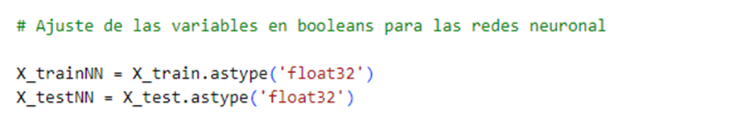
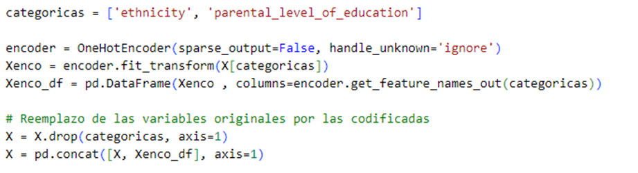
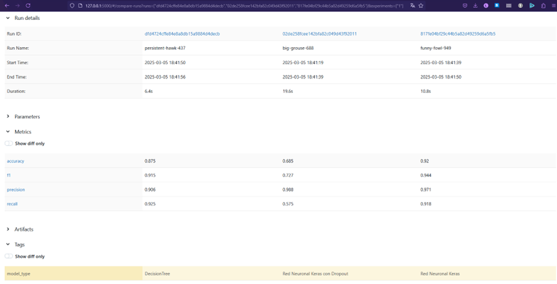

# Predicción de Resultados en Exámenes de Matemáticas

Este proyecto implementa modelos de Machine Learning para resolver un problema de clasificación: predecir si un estudiante aprobará un examen de matemáticas. Para ello, se utilizan árboles de decisión y redes neuronales con TensorFlow/Keras.

## Implementación de los Modelos

### Información del Dataset

El dataset contiene **3012 registros** y **8 características** que pueden ser utilizadas para predecir si un estudiante aprobará la prueba de matemáticas, escritura o lectura. Para este análisis, se seleccionó el subconjunto relacionado con los resultados de las pruebas de matemáticas.

**Fuente:** [Student Performance Dataset - Hugging Face](https://huggingface.co/datasets/mstz/student_performance)

#### Características del dataset:

| Característica                    | Tipo   |
|-----------------------------------|--------|
| `is_male`                        | bool   |
| `ethnicity`                       | string |
| `parental_level_of_education`     | int8   |
| `has_standard_lunch`              | bool   |
| `has_completed_preparation_test`  | bool   |
| `reading_score`                   | int64  |
| `writing_score`                   | int64  |
| `math_score`                      | int64  |

---

### Preprocesamiento de los Datos

La mayoría de las variables del dataset ya habían sido codificadas previamente. Sin embargo, se realizaron algunos ajustes adicionales:

- **Variables booleanas:** Se adaptaron para que pudieran ser utilizadas por las redes neuronales.


- **Codificación de variables categóricas:** Se aplicó `OneHotEncoder` a `ethnicity` y `parental_level_of_education`.



---

### Modelos Implementados

A continuación, se describen los modelos utilizados en este proyecto:

#### 1. Árbol de Decisión

Se utilizó un árbol con las siguientes configuraciones:

- **Profundidad máxima:** 5
- **Mínimo de muestras para dividir un nodo:** 2
- **Mínimo de muestras en una hoja:** 1


---

#### 2. Red Neuronal con Capa de Regularización

Se utilizó una red neuronal con las siguientes configuraciones:

**Estructura de la red:**
- **Capa oculta 1:** 128 neuronas, función de activación ReLU.
- **Dropout (0.3):** Capa de regularización.
- **Capa oculta 2:** 64 neuronas, activación ReLU.
- **Dropout (0.3):** Se aplica nuevamente la regularización.
- **Capa oculta 3:** 32 neuronas, activación ReLU.
- **Capa de salida:** 1 neurona con activación sigmoide para clasificación binaria.

---

#### 3. Red Neuronal sin Regularización

Este modelo es similar al anterior pero **sin capas de regularización**,.

**Estructura de la red:**
- **Capa oculta 1:** 64 neuronas, activación ReLU.
- **Capa oculta 2:** 32 neuronas, activación ReLU.
- **Capa de salida:** 1 neurona con activación sigmoide.

---

## Resultados

El **árbol de decisión** fue el modelo que completó el entrenamiento en el menor tiempo (**6.4s**), seguido por la **red neuronal sin regularización** (**10.8s**).  
Si analizamos las métricas, el modelo más adecuado para este conjunto de datos fue la **red neuronal sin regularización**, que alcanzó una **exactitud de 0.92**. Adicionalmente, el **recall de 0.91** indica que la mayoría de sus predicciones están relacionadas con verdaderos positivos.

### Comparación de Métricas

| Métrica / Modelo            | Árbol de Decisión | Red Neuronal con Regularización | Red Neuronal sin Regularización |
|-----------------------------|-------------------|---------------------------------|---------------------------------|
| **Exactitud**               | 0.875             | 0.685                           | **0.92**                        |
| **F1-score**                | 0.915             | 0.727                           | **0.944**                       |
| **Precisión**               | 0.906             | **0.988**                        | **0.971**                        |
| **Recall**                  | **0.925**         | 0.575                           | 0.918                           |

---


## Conclusión

Los resultados indican que la **red neuronal sin regularización** obtuvo el mejor desempeño en términos de exactitud y recall, lo que la convierte en la opción más adecuada para este problema de clasificación.

# Ejecución del experimento en MLFlow


## Requisitos

- Python 3.9+
- Docker (para ejecutar en contenedor)
- [uv](https://github.com/astral-sh/uv) para la gestión de paquetes y entornos viruales

### Ejecución en equipo locales

1. **Inicializar el entorno del proyecto:**

   ```bash
   uv init
   ```

2. **Activación del entorno:**

   ```bash
   .venv/Scripts/activate
   ```

3. **Instalar dependencias dentro del entorno virtual:**

   ```bash
   uv pip install -r requirements.txt
   ```

4. **Iniciar MLflow en el puerto 5000:**

Iniciar el servidor local de MLflow, ejecutando:

```bash
mlflow server --backend-store-uri sqlite:///mlflow.db --host 0.0.0.0 --port 5000
```

5. **Ejecutar la aplicación:**

```bash
python app.py
```
6. Visualizar los experimentos en [http://127.0.0.1:5000](http://127.0.0.1:5000).


Esto entrenará los modelos y registrará los resultados en MLflow.

## Ejecución en Docker

Para ejecutar este proyecto dentro de un contenedor Docker:

1. **Construir la imagen:**

   ```bash
   docker build -t aprobacionmate:v1 .
   ```

2. **Ejecutar el contenedor:**

   ```bash
   docker run -d  -p 5000:5000 aprobacionmate:v1   
   ```

Esto iniciará el entrenamiento de los modelos dentro del contenedor y los resultados se registrarán en MLflow.

3. Visualizar los experimentos en [http://localhost:5000]([http://localhost:5000).

## Contribución

- Gabriel Antonio Vallejo Loaiza -  2250145
- Juan Fernando Rodriguez - 2240585
- Luis Felipe Carabali Balanta - 2244790
- Gregth Raynell Hernández Buenaño - 2250194
